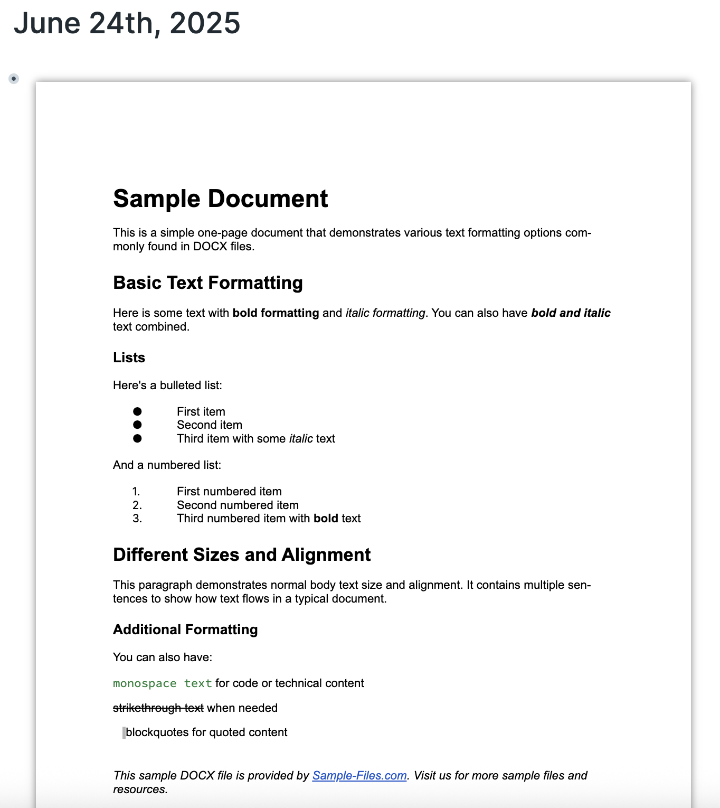

Roam Research allows you to upload and render pdfs, but until now you couldn't do that for DOCX files. You can with this extension.

Drag & drop, paste or `/upload` a docx file into your graph and the extension will recognise the file, and render it in place.

If your document is more than one page long, the docx previewer will try to paginate and show buttons as below. (If your document is a single page the buttons will not appear.)

You can also examine existing pages for docx files you've uploaded to your graph, and convert them to the correct format to allow them to render.

There are several ways you can do this:
1. Command Palette options
    - Render DOCX files in page - will check all blocks on the page for docx files
    - Render DOCX files in focused block - will check the currently focused block for docx files
    - Render DOCX files in focused block and children - will check the focused block and all children for docx files

2. Block Context menu
    - Render DOCX files in block(s) - will check the selected block for docx files
    - Render DOCX files in block(s) and children - will check the selected block and all of its children for docx files

3. Multiselect Context menu
    - if you drag your mouse over several blocks and then right-click on the highlighted area, you can then use Plugins / Render DOCX files in selected block(s)

4. Individual Multiselect
    - you can select non-adjacent blocks using individual multiselect and then open the block context menu on any of them, select Extensions / Render DOCX files in block(s).

With many thanks to [@dvargas92495](https://github.com/dvargas92495) and [@mdroidian](https://github.com/mdroidian) for their brilliant work and community contribution of https://github.com/RoamJS/roamjs-components. None of my extensions that use react components would be possible without their generosity.

**Important Limitations:**
- this extension allows you to preview docx files, but not edit them. AFAIK there are no nodejs packages that will render a docx file in React that would allow editing to occur.
- there might be some rendering issues for some content, as the imported library converts the docx content to html to render it.
- some docx documents will appear very long, as the renderer looks for page breaks within the source and if it doesn't find any it continues to render the content without forcing a page break